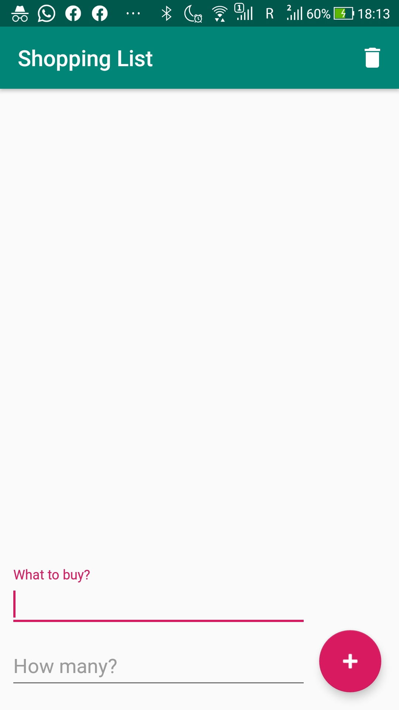
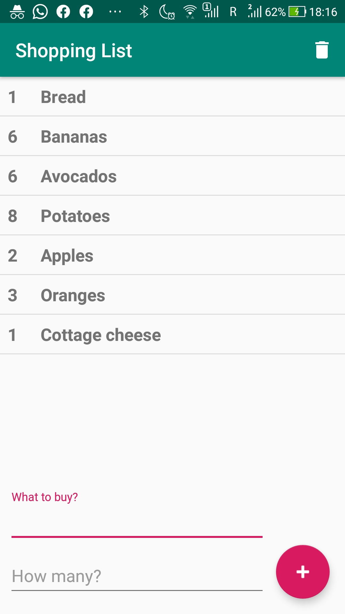
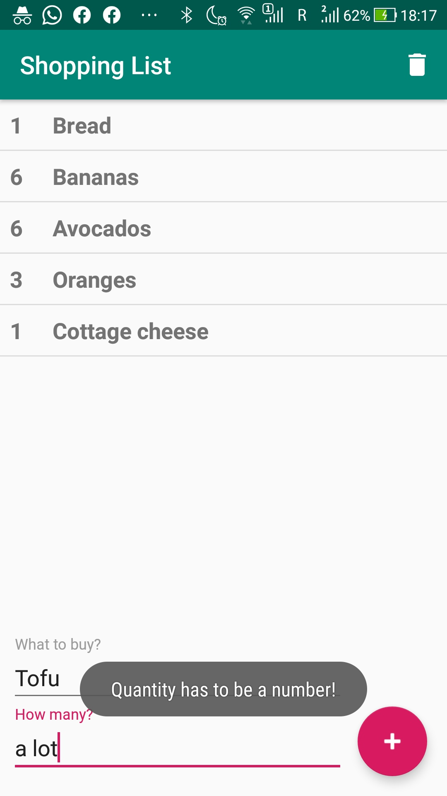
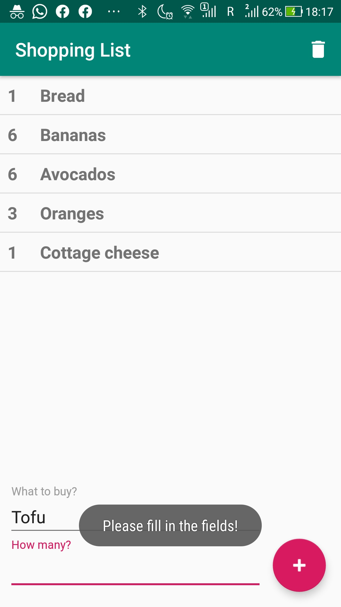

# Level 4 Learning Task 1 - Shopping List Kotlin
This is the first learning task of the fourth level. This task was more challenging and we had to apply such skills as the usage of Room database and RecyclerView.
## What's inside
This is an app in which the user is able to add and delete shopping list items. The user can add items using the plus button and delete items by swiping them to the left. The user can also delete all items by pressing the garbage bin icon in the toolbar.
## Screenshots
    
    
